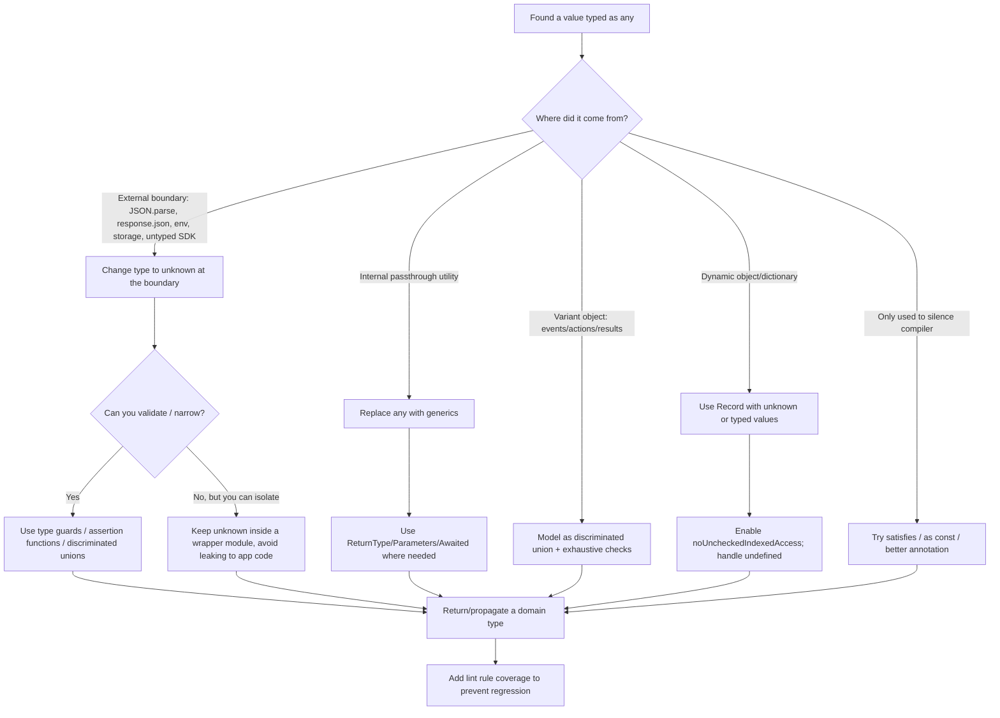

# The Stronger the Types, the Weaker the Bugs

TypeScript is as helpful as its types. Removing `any` is less about "typing everything" and more about controlling **where uncertainty is allowed**. `any` disables type checking and can be assigned to/from anything, so it tends to "infect" nearby types and obscure real bugs. The most effective approach is to (a) prevent new `any` from entering, (b) move unavoidable uncertainty to **explicit boundaries** using `unknown`, then (c) rapidly narrow to precise domain types using type guards, discriminated unions, and generics.

## Rule Comparison Table

| Priority | Rule (short name) | Difficulty | Impact | Typical areas affected |
|---|---|---|---|---|
| A | Gate new `any` (compiler + ESLint) | Low-Med | Very High | Whole codebase, CI, pre-commit |
| A | Boundary `unknown` + narrowing | Med | Very High | API/JSON, IO, env/config, parsing |
| A | Generics instead of `any` passthrough | Med | High | Utility libs, hooks/helpers, data wrappers |
| B | Discriminated unions + exhaustiveness | Med | High | State machines, reducers, API results, events |
| B | Typed dictionaries + strict indexed access | Med | High | Config maps, caches, registries, env |
| B | Named types over indexed-access lookups | Low | Med-High | Function signatures, method params, public APIs |
| B | Replace `as any` with safer constructs | Med-High | High | DOM, interop, migrations, complex data |
| B | Remove `Function`/callback `any` | Med | Med-High | Event systems, middleware, higher-order fns |
| C | Safer errors (`unknown` errors) | Low-Med | Medium | Error boundaries, Promise chains, logging |
| C | Type third-party modules (local `.d.ts`/patch) | Med-High | Medium | Integrations, SDKs, legacy JS |
| C | Utility/mapped/conditional types (use judiciously) | High | Medium | SDK clients, typed transformations, libraries |

---

## Fix Hierarchy (follow in order)

When you encounter `any`, work through this list top-to-bottom. Use the **first** approach that works. Do NOT skip to casting.

### 1. Declare the correct type directly (most common fix)

If you know what the value is, just type it. This covers the vast majority of cases.

```ts
// BAD
function getUser(data: any): string {
  return data.name;
}

// GOOD
function getUser(data: { name: string }): string {
  return data.name;
}
```

```ts
// BAD
const config: any = loadConfig();

// GOOD
const config: AppConfig = loadConfig();
```

### 2. Use generics for reusable code

When a function works with multiple types, use generics instead of `any`.

```ts
// BAD
function wrapInArray(value: any): any[] {
  return [value];
}

// GOOD
function wrapInArray<T>(value: T): T[] {
  return [value];
}
```

### 3. Use union types when the set of types is known

```ts
// BAD
function format(value: any): string { ... }

// GOOD
function format(value: string | number | boolean): string { ... }
```

### 4. Use `unknown` with type guards for truly unknown data

Only use `unknown` when data genuinely arrives with no type information -- external API responses, parsed JSON, user input, deserialized messages. Pair it with type guards or validation to narrow the type.

```ts
// Truly unknown: parsing external JSON
async function fetchData(): Promise<ApiResponse> {
  const response = await fetch('/api/data');
  const json: unknown = await response.json();

  if (!isApiResponse(json)) {
    throw new Error('Invalid API response');
  }

  return json;
}
```

### 5. Use `as T` (single cast) when TypeScript can't infer but the type is safe

A single `as T` is acceptable when TypeScript's inference falls short but you have structural confidence the value matches the target type. Common cases: test fixtures, factory returns, framework callbacks.

```ts
// Acceptable: test mock where the shape is known
const mockService = {
  findById: jest.fn().mockResolvedValue(testUser),
  save: jest.fn(),
} as UserService;
```

### 6. Use `as unknown as T` (double cast) -- LAST RESORT ONLY

**This is an escape hatch, not a refactoring tool.** Only use when ALL of the following are true:

- A single `as T` does not compile (TypeScript actively rejects the cast)
- You cannot restructure the code to avoid the cast
- You have runtime confidence the value matches the target type

```ts
// LEGITIMATE: Incompatible library types that represent the same thing
const adapter = externalLibResult as unknown as InternalType;

// NOT LEGITIMATE: You just didn't bother finding the right type
const data = someValue as unknown as MyType; // FIX THE SOURCE TYPE INSTEAD
```

---

## Rule A: Gate New `any` (Compiler + ESLint)

**Rule.** Treat `any` as a controlled exception. Enforce that new `any` cannot enter the codebase unnoticed by using both TypeScript compiler checks and type-aware ESLint rules.

**Rationale.** `noImplicitAny` is necessary but insufficient: it catches "compiler inferred" `any`, but doesn't prevent explicit `any` and doesn't stop some "ambient" sources. The `@typescript-eslint/no-explicit-any` rule reports explicit `any` and can auto-fix to `unknown`. The `no-unsafe-*` rules catch "viral any" usage patterns that spread `any` through your code.

**Refactoring steps:**
1. Ensure `noImplicitAny` is enabled.
2. Add ESLint with `@typescript-eslint/no-explicit-any` and optionally set `fixToUnknown: true`.
3. Add the `no-unsafe-*` rules (no-unsafe-assignment/member-access/call/return/argument).
4. Fail CI on new violations, then work down the backlog starting with shared libs and boundary modules.

```ts
// BAD: implicit any (if TypeScript cannot infer it)
function formatUser(user) {
  return user.name.toUpperCase();
}
```

```ts
// GOOD: explicit type
interface User {
  name: string;
}

function formatUser(user: User) {
  return user.name.toUpperCase();
}
```

```ts
// BAD: explicit any
export function parse(input: any) {
  return input.value;
}
```

```ts
// GOOD: start with unknown, then narrow
export function parse(input: unknown) {
  if (typeof input === "object" && input !== null && "value" in input) {
    return (input as { value: unknown }).value;
  }

  throw new Error("Invalid input");
}
```

**Pitfalls:**
- Turning on `no-explicit-any` without `no-unsafe-*` leaves many unsafe operations undetected because `any` can still enter through libraries and unsafe types.
- Blindly auto-fixing all `any` to `unknown` can surface many errors at once; that's expected because `unknown` forces you to validate assumptions.

---

## Rule A: Boundary `unknown` + Narrowing

**Rule.** Whenever data comes from outside the type system -- JSON parsing, network responses, environment variables, localStorage, untyped code -- type it as `unknown` at the boundary, then narrow/validate it into a trusted domain type.

**Rationale.** TypeScript introduced `unknown` as the "type-safe counterpart of `any`": anything can be assigned to `unknown`, but you cannot do operations on it until you narrow or assert. Key boundary APIs are typed as `any` today: `JSON.parse(...)` returns `any`, DOM `Body.json()` returns `Promise<any>`.

**Refactoring steps:**
1. Identify boundary calls that yield `any` (common culprits: `JSON.parse`, `response.json()`, untyped SDK returns).
2. Immediately wrap them in a "decode" step that yields `unknown`.
3. Validate/narrow to a precise type using built-in narrowing (`typeof`, `instanceof`, `"prop" in obj`), custom type guards, assertion functions, or a schema validation library.
4. After decoding, propagate only the validated domain type internally.

```ts
// BAD: JSON.parse() returns any, everything below is unchecked
interface Shape {
  label: string;
  value: number;
}

export function parseShape(raw: string): Shape {
  const shape = JSON.parse(raw); // any
  return {
    label: shape.label,
    value: shape.value,
  };
}
```

```ts
// GOOD: treat parsed JSON as unknown, then validate
interface Shape {
  label: string;
  value: number;
}

function isShape(x: unknown): x is Shape {
  return (
    typeof x === "object" &&
    x !== null &&
    "label" in x &&
    "value" in x &&
    typeof (x as any).label === "string" &&
    typeof (x as any).value === "number"
  );
}

export function parseShape(raw: string): Shape {
  const data: unknown = JSON.parse(raw);

  if (!isShape(data)) {
    throw new Error("Invalid Shape JSON");
  }

  return data;
}
```

```ts
// BAD: response.json() returns Promise<any>
async function getUser() {
  const res = await fetch("/api/user");
  const data = await res.json(); // any
  return data.name.toUpperCase(); // unchecked
}
```

```ts
// GOOD: validate at the boundary
interface User {
  name: string;
}

function isUser(x: unknown): x is User {
  return typeof x === "object" && x !== null && "name" in x && typeof (x as any).name === "string";
}

async function getUser(): Promise<User> {
  const res = await fetch("/api/user");
  const data: unknown = await res.json();

  if (!isUser(data)) throw new Error("Invalid user payload");

  return data;
}
```

**Pitfalls:**
- "Validating" with `as User` is not validation; type assertions are compile-time only and don't add runtime checks.
- Overusing `any` inside guards defeats their purpose. Prefer small, localized assertions if needed, or use assertion functions.

---

## Rule A: Generics Instead of `any` Passthrough

**Rule.** If a function/class is meant to work for "any type," it should be **generic**, not typed with `any`. Generics preserve the caller's type information instead of collapsing to "unchecked."

**Refactoring steps:**
1. Find helpers that accept/return `any` but are logically "identity-like", "map-like", or wrap/forward values.
2. Identify what the type parameter represents (often the input/output type).
3. Introduce `<T>` and ensure the return type uses `T`.
4. Add constraints (`extends`) only when the implementation requires properties/methods.

```ts
// BAD: type information is destroyed
export function unwrap(value: any) {
  return value;
}
```

```ts
// GOOD: type is preserved
export function unwrap<T>(value: T): T {
  return value;
}
```

```ts
// BAD: result becomes any
async function withTiming(fn: () => Promise<any>) {
  const start = Date.now();
  const result = await fn();
  console.log(Date.now() - start);
  return result;
}
```

```ts
// GOOD: preserve function return type precisely
async function withTiming<F extends () => Promise<unknown>>(fn: F): Promise<Awaited<ReturnType<F>>> {
  const start = Date.now();
  const result = await fn();
  console.log(Date.now() - start);
  return result as Awaited<ReturnType<F>>;
}
```

**Pitfalls:**
- "Return-type-only generics" that don't appear in parameters often can't be inferred well; prefer having type parameters appear in inputs so callers get inference "for free."
- Don't write `<T extends any>` -- it's effectively the same as `<T>` and does not improve safety.

---

## Rule B: Discriminated Unions + Exhaustiveness

**Rule.** Replace "bag of `any`" event/state/response objects with discriminated unions (tagged unions) that TypeScript can narrow automatically, and add exhaustiveness checks to prevent unhandled cases.

**Rationale.** TypeScript narrows unions effectively when each variant has a shared discriminant property with literal values. Exhaustiveness checking uses `never` to ensure all union cases are handled.

**Refactoring steps:**
1. Identify variant objects currently typed as `any` (common: API results, reducer actions, events).
2. Define a union where each variant includes a `kind`/`type` field with a string literal.
3. Switch/if on that field to narrow.
4. Add a `default` clause with `const _exhaustive: never = value;` to ensure future variants cause compiler errors.

```ts
// BAD: everything is unchecked
function reducer(state: any, action: any) {
  if (action.type === "ADD") return { ...state, count: state.count + 1 };
  if (action.type === "RESET") return { ...state, count: 0 };
  return state;
}
```

```ts
// GOOD: discriminated union + exhaustiveness
type State = { count: number };

type Action =
  | { type: "ADD"; amount: number }
  | { type: "RESET" };

function reducer(state: State, action: Action): State {
  switch (action.type) {
    case "ADD":
      return { ...state, count: state.count + action.amount };
    case "RESET":
      return { ...state, count: 0 };
    default: {
      const _exhaustive: never = action;
      return _exhaustive;
    }
  }
}
```

**Pitfalls:**
- Adding optional properties instead of splitting variants makes narrowing weaker and often requires non-null assertions (`!`). Discriminated unions avoid that by construction.
- Don't forget to update all switch statements when adding new variants -- exhaustiveness checks make this safe by forcing compiler errors.

---

## Rule B: Typed Dictionaries + Strict Indexed Access

**Rule.** When you truly have dynamic keys, type them explicitly (keys and values). Avoid `any` values in maps/records; prefer `Record<string, unknown>` at the boundary or `Record<K, V>` with specific types. Use strict index-access options to prevent unsafe assumptions.

**Refactoring steps:**
1. Replace `Record<string, any>` with `Record<string, unknown>` if the values are genuinely uncertain at entry.
2. If keys are a known finite set, derive them from a constant object (`as const`) and use `keyof typeof`.
3. Enable `noUncheckedIndexedAccess` so missing keys must be handled.
4. Narrow values (or validate) before use.

```ts
// BAD
type Options = Record<string, any>;

function getTimeout(options: Options) {
  return options.timeoutMs + 100; // unchecked; timeoutMs may be string/null/etc
}
```

```ts
// GOOD: unknown values + narrowing
type Options = Record<string, unknown>;

function getTimeout(options: Options): number {
  const raw = options["timeoutMs"];

  if (typeof raw !== "number") return 0;

  return raw + 100;
}
```

```ts
// BAD: loses key precision
const routes: Record<string, any> = {
  home: { path: "/", auth: false },
  admin: { path: "/admin", auth: true },
};
```

```ts
// GOOD: keep precise keys with satisfies + explicit value type
type RouteConfig = { path: string; auth: boolean };

const routes = {
  home: { path: "/", auth: false },
  admin: { path: "/admin", auth: true },
} satisfies Record<string, RouteConfig>;
```

**Pitfalls:**
- Using `Record<string, unknown>` without narrowing just pushes the problem downstream; the point is to force validation at use-sites or decode once and then work with a typed object.
- Enabling `noUncheckedIndexedAccess` can feel noisy at first, but it makes implicit "key exists" assumptions explicit.

---

## Rule B: Named Types Over Indexed-Access Lookups

**Rule.** If an exported named type already describes the shape you need, use it directly. Do not reach into a container type with an indexed-access query like `Container['field']` just to recover the element type of a field.

**Rationale.** Indexed access (`T['k']`) is a powerful escape hatch for deriving a type *when no name exists* — anonymous inner types, tuple elements, callback shapes inside a library type. But when the field's type *is* a named export, `Container['field']` is strictly worse than using that name:

- It hides intent. `V2ExportPayload['activities']` tells the reader "whatever `activities` is on that payload." `ExportedActivity[]` tells them exactly what is being consumed.
- It couples every call site to the container. Renaming `activities` → `steps` on the container breaks every signature that reached in, even though the element type didn't change.
- It obscures reusability. A reader scanning imports can't tell the function operates on the same `ExportedActivity` that the rest of the module handles — the relationship is buried in a lookup.
- It defeats rename/find-references. "Find all uses of `ExportedActivity`" misses every site that typed its parameter as `V2ExportPayload['activities']`.

Indexed access belongs where the element type has no public name. If the name exists, use it.

**Refactoring steps:**
1. Grep for `<TypeName>\[['"]` in changed files (e.g. `Payload\['`, `Props\['`).
2. For each hit, check whether the field's type is already an exported named type (look at the container's definition).
3. If a name exists: replace the indexed lookup with the named type, add the import, and verify the build.
4. If no name exists but the type is used in multiple places: *extract* a named type and export it, then import it where needed.
5. Keep indexed access only where the inner type is genuinely anonymous and single-use (one-off callbacks, ad-hoc config shapes inside generic helpers).

```ts
// BAD: reaching into the container to grab a field type that already has a name
export interface V2ExportPayload {
  activities: ExportedActivity[];
  components: ExportedComponent[];
  eventTracks: ExportedEventTrack[];
}

class Service {
  private remapActivities(activities: V2ExportPayload['activities']) { /* ... */ }
  private remapComponents(components: V2ExportPayload['components']) { /* ... */ }
  private remapEventTracks(events: V2ExportPayload['eventTracks']) { /* ... */ }
}
```

```ts
// GOOD: import the element types directly
import {
  ExportedActivity,
  ExportedComponent,
  ExportedEventTrack,
  V2ExportPayload,
} from './migrate-interfaces';

class Service {
  private remapActivities(activities: ExportedActivity[]) { /* ... */ }
  private remapComponents(components: ExportedComponent[]) { /* ... */ }
  private remapEventTracks(events: ExportedEventTrack[]) { /* ... */ }
}
```

```ts
// ALSO BAD: indexed lookup through a method/return shape when the payload is named
async function handleResponse(data: Awaited<ReturnType<typeof fetchUser>>['profile']) { /* ... */ }
```

```ts
// GOOD: if UserProfile is exported, use it
async function handleResponse(data: UserProfile) { /* ... */ }
```

**When indexed access is still correct:**

- The inner type is anonymous and exists only inline on the container:
  ```ts
  // Fine — there is no exported name for the inner shape
  type StatusHandler = (ctx: RequestCtx['internals']['retry']) => void;
  ```
- You're writing generic plumbing that must stay in lockstep with the container:
  ```ts
  function getField<K extends keyof Config>(cfg: Config, key: K): Config[K] { /* ... */ }
  ```
- Deriving utility types (`Parameters<F>`, `ReturnType<F>`, `Awaited<T>`, `keyof T`) — these are not the pattern this rule addresses.

**Pitfalls:**
- "But the container already imports the element type!" — the function's *signature* is the contract. Readers of the signature shouldn't need to open the container to know what it accepts.
- Mixed codebases: if some sites use the named type and others use indexed access, unify on the named type. The inconsistency alone is a readability cost.
- Don't chase this rule into test files or throwaway scripts where the coupling is intentional and local.

**How to catch this in review:**
- `rg "\\b[A-Z]\\w+\\[['\\\"]" --type ts` highlights indexed-access usages; skim each and ask "does the field type have a name?"
- ESLint rule proposal: if your project allows custom rules, write a `no-redundant-indexed-access` rule that flags `X['k']` when `X` is an interface and `X.k` resolves to a named type export.

---

## Rule B: Replace `as any` with `satisfies`, Assertion Functions, and Staged Narrowing

**Rule.** Type assertions should be a last resort; they don't add runtime checks. Prefer constructs that preserve inference while checking compatibility (`satisfies`), or perform runtime checks and then narrow types (assertion functions / type guards).

**Rationale.** Type assertions are removed at compile time and have **no runtime checking**. TypeScript 4.9 introduced `satisfies` to verify an expression matches a type while preserving its most specific inferred type.

**Refactoring steps:**
1. For object literals widened to `any` or forced with `as any`, try `satisfies` to validate shape without losing inference.
2. For values that must be runtime-checked, write a type guard (`x is T`) or assertion function (`asserts x is T`).
3. Reserve `as any` for isolated, documented escape hatches.

```ts
// BAD: bypasses checking; typos slip through
const cfg = {
  cacheTtlMs: "5000", // should be number
  enableFeatreX: true, // typo
} as any;
```

```ts
// GOOD: validate required fields while keeping inference
type Config = {
  cacheTtlMs: number;
  enableFeatureX: boolean;
};

const cfg = {
  cacheTtlMs: 5000,
  enableFeatureX: true,
} satisfies Config;
```

```ts
// BAD: assertion without checks
function asUser(x: any) {
  return x as { id: string; name: string };
}
```

```ts
// GOOD: assertion function with runtime validation
type User = { id: string; name: string };

function assertUser(x: unknown): asserts x is User {
  if (
    typeof x !== "object" ||
    x === null ||
    !("id" in x) ||
    !("name" in x) ||
    typeof (x as any).id !== "string" ||
    typeof (x as any).name !== "string"
  ) {
    throw new Error("Not a User");
  }
}

function handleUser(payload: unknown) {
  assertUser(payload);
  // payload is now User
  console.log(payload.name.toUpperCase());
}
```

**Pitfalls:**
- Overusing type assertions (`as T`) can reintroduce "unchecked" behavior similar to `any`.
- `satisfies` checks compatibility but does not coerce values; it's ideal for object literals and maps but not for validating external runtime input.

---

## Rule B: Remove `Function`/Callback `any`; Use Explicit Call Signatures

**Rule.** Replace `Function`, `(...args: any[]) => any`, and callback args typed as `any` with explicit call signatures (or carefully constrained generics).

**Rationale.** `Function` is unsafe because it allows being called with any arguments and returns `any`. Rest args (`...args: any[]`) are a common source of explicit `any`.

**Refactoring steps:**
1. Replace `Function` with an explicit signature: `() => R`, `(a: A) => R`, etc.
2. For higher-order functions, define a generic function type and use `Parameters`/`ReturnType` to preserve signature.
3. For truly variadic patterns, use `unknown[]` or `never[]` rather than `any[]` for the args.

```ts
// BAD
function runLater(task: Function) {
  return task("not validated"); // unchecked
}
```

```ts
// GOOD
function runLater(task: (name: string) => void) {
  return task("validated");
}
```

```ts
// BAD
function once(fn: (...args: any[]) => any) {
  let called = false;
  return (...args: any[]) => {
    if (called) return;
    called = true;
    return fn(...args);
  };
}
```

```ts
// GOOD: preserve signature safely
function once<F extends (...args: unknown[]) => unknown>(fn: F) {
  let called = false;

  return (...args: Parameters<F>): ReturnType<F> | undefined => {
    if (called) return;
    called = true;
    return fn(...args) as ReturnType<F>;
  };
}
```

**Pitfalls:**
- Typing rest args as `unknown[]` is safer than `any[]`, but you must still ensure you don't "blindly forward" unknown values into typed functions without validation (lint rules like `no-unsafe-argument` help).
- Overloads may be clearer than complex conditional/mapped types for public APIs.

---

## Rule C: Safer Errors -- `unknown` in `catch` and Promise Rejection Callbacks

**Rule.** Treat thrown/rejected values as unknown. Narrow them before accessing properties like `.message`.

**Rationale.** TypeScript provides `useUnknownInCatchVariables` to change `catch` variable type from `any` to `unknown`. There's no compiler equivalent for Promise `.catch()` callbacks, so typescript-eslint provides `@typescript-eslint/use-unknown-in-catch-callback-variable`.

**Refactoring steps:**
1. Enable `useUnknownInCatchVariables`.
2. Replace `catch (e)` usages that assume `e` is `Error` with `if (e instanceof Error) { ... }` or a custom type guard.
3. Add `use-unknown-in-catch-callback-variable` for Promise chains.

```ts
// BAD
try {
  doWork();
} catch (err) {
  console.error(err.message); // err is any by default without the flag
}
```

```ts
// GOOD
try {
  doWork();
} catch (err: unknown) {
  if (err instanceof Error) {
    console.error(err.message);
  } else {
    console.error("Non-Error thrown:", err);
  }
}
```

```ts
// BAD
Promise.reject("nope").catch((err) => {
  console.log(err.message); // unchecked
});
```

```ts
// GOOD
Promise.reject("nope").catch((err: unknown) => {
  if (err instanceof Error) console.log(err.message);
});
```

**Pitfalls:**
- Assuming everything thrown is an `Error` is unsafe in JavaScript; you must narrow or handle non-Error values.

---

## Rule C: Patch Third-Party Typing Gaps Instead of Spreading `any`

**Rule.** When a dependency lacks typings or provides weak typings, don't compensate by using `any` everywhere. Introduce a typed boundary: local module declarations, wrapper layer, or contribute/fix types.

**Refactoring steps:**
1. Identify imports typed as `any` (or `require()` usages returning `any`).
2. Create `src/types/vendor/<lib>.d.ts` with the smallest useful surface area.
3. Add a wrapper module that converts "untyped" outputs to `unknown`, validates them, and exports typed functions.
4. Optionally upstream the typings (DefinitelyTyped contribution).

```ts
// BAD: untyped module leaks any everywhere
import legacy from "legacy-sdk"; // implicitly any
```

```ts
// GOOD: minimal local type shim (src/types/legacy-sdk.d.ts)
declare module "legacy-sdk" {
  export function getUser(id: string): unknown;
}
```

```ts
// Then in code: validate unknown -> User
import { getUser } from "legacy-sdk";

type User = { id: string; name: string };

function isUser(x: unknown): x is User {
  return typeof x === "object" && x !== null && "id" in x && "name" in x;
}

async function fetchUser(id: string): Promise<User> {
  const u = await Promise.resolve(getUser(id));

  if (!isUser(u)) throw new Error("Bad SDK data");

  return u;
}
```

**Pitfalls:**
- Writing a "fake" `.d.ts` that returns a domain type directly (without validation) can reintroduce unsoundness. Prefer returning `unknown` and validating at the wrapper boundary.

---

## Rule C: Utility/Mapped/Conditional Types (Use Judiciously)

**Rule.** Use built-in utility types (`Pick`, `Omit`, `Partial`, `Record`, `ReturnType`, `Awaited`, etc.) and -- when necessary -- mapped/conditional types to derive types rather than falling back to `any` for "type transformations." But keep type-level complexity readable.

**Refactoring steps:**
1. Prefer built-in utility types before writing new type machinery.
2. If reaching for `any` to represent "a derived view" of a domain model, try `Pick`/`Omit`/`Partial` or explicit named interfaces first.
3. If you do need conditional/mapped types, keep them small, name them well, and add examples/tests.

```ts
// BAD: "patch" payload is any
type UpdateUserPayload = any;

function updateUser(id: string, patch: UpdateUserPayload) {
  // ...
}
```

```ts
// GOOD: derive a safe shape from the domain model
type User = {
  id: string;
  name: string;
  email: string;
  isAdmin: boolean;
};

type UpdateUserPayload = Partial<Omit<User, "id">>;

function updateUser(id: string, patch: UpdateUserPayload) {
  // ...
}
```

```ts
// BAD: uses any to avoid expressing a transformation
type ApiResult = any;
```

```ts
// GOOD: explicit representation
type Ok<T> = { ok: true; value: T };
type Err = { ok: false; error: string };
type Result<T> = Ok<T> | Err;
```

**Pitfalls:**
- Creating very complex mapped/conditional types can harm readability and tooling; consider explicit interfaces as a cheaper long-term cost when possible.

---

## Anti-Patterns to Avoid

```ts
// DON'T: Blindly replace `any` with `unknown` then double-cast everywhere
const value: unknown = getData();
const typed = value as unknown as MyType; // This is just `any` with extra steps

// DO: Type the source
const value: MyType = getData(); // Fix getData's return type if needed
```

```ts
// DON'T: Use double-cast to silence a type error you don't understand
const result = response.data as unknown as ExpectedType;

// DO: Investigate why the types don't match and fix the mismatch
// Maybe response.data needs a generic: response.data as AxiosResponse<ExpectedType>
```

```ts
// DON'T: Cast when a type parameter would work
function process(items: unknown[]): MyType[] {
  return items.map(item => item as unknown as MyType);
}

// DO: Use the type system
function process(items: MyType[]): MyType[] {
  return items;
}
```

---

## Symptom-to-Rule Mapping

| Symptom ("where `any` shows up") | Most effective rule(s) |
|---|---|
| `JSON.parse` result used directly | Boundary `unknown` + decode (Rule A) |
| `response.json()` used directly | Boundary `unknown` + decode (Rule A) |
| Helpers return/accept `any` | Generics + `ReturnType`/`Awaited` (Rule A) |
| `Record<string, any>` configs/maps | Typed dictionaries + `noUncheckedIndexedAccess` (Rule B) |
| `Container['field']` when the field's type has a name | Named types over indexed-access lookups (Rule B) |
| `as any` sprinkled in code | `satisfies` / assertion functions / staged narrowing (Rule B) |
| `Function` used as a type | Explicit signature + lint ban (Rule B) |
| `catch (e)` with `e.message` | `useUnknownInCatchVariables` + narrowing (Rule C) |
| Untyped dependency leads to `any` imports | Local `.d.ts` + wrapper boundary (Rule C) |

## Decision Guide

| Situation | Action |
|---|---|
| You know what the value is | Declare the correct type directly |
| Reusable function with multiple types | Use generics `<T>` |
| Known set of possible types | Use union type `A \| B \| C` |
| External data with no type info | Use `unknown` + type guards |
| TS inference falls short, type is safe | Use single `as T` |
| Single cast rejected, no restructure possible | Use `as unknown as T` (last resort) |

## Decision Process Flowchart



---

## When It's Acceptable to Keep `any`

Keeping `any` can be reasonable when it is **isolated**, **documented**, and **temporary**:

- **Prototyping or incremental TS adoption**: using `any` temporarily while migrating a codebase is a known exception in lint guidance.
- **Missing/incorrect third-party typings**: you may need `any` while waiting for or authoring `.d.ts` types, but prefer a wrapper boundary.
- **Tests/mocks**: `any` can be legitimate in tests (e.g., partial mocks) if you suppress lint warnings and document why.
- **Type-system limitations**: very complex code may not be representable in TS today; a narrowly scoped `any` escape hatch may be the best compromise.

### Safer Alternatives to Prefer Before `any`

| If you were about to write... | Prefer... | Why it's safer |
|---|---|---|
| `any` for unknown data | `unknown` | Forces narrowing; no arbitrary property access |
| `{}` as "some object" | `unknown` / `Record<string, T>` / `object` | `{}` is overly broad |
| `Record<string, any>` | `Record<string, unknown>` or `Record<K, V>` | Keeps uncertainty explicit and local |
| `Function` | Explicit call signature | `Function` returns `any` and accepts any args |
| `as any` to satisfy compiler | `satisfies`, `as const`, or runtime assertion + `unknown` | Preserves inference and/or adds runtime validation |

**Policy**: prefer `unknown`, and only allow `any` behind a documented lint suppression with a short explanation and (if possible) a tracking link/ticket.

---

## Tooling and Configuration Checklist

### TypeScript Compiler Options

- `noImplicitAny`: flags implicit `any` when TS can't infer a better type
- `strict`: enables a family of stricter checks
- `useUnknownInCatchVariables`: changes `catch` variables from `any` to `unknown`
- `noUncheckedIndexedAccess`: adds `undefined` to un-declared indexed fields
- `noPropertyAccessFromIndexSignature`: forces consistent access patterns for index signature properties
- `exactOptionalPropertyTypes`: strengthens optional property semantics

```json
{
  "compilerOptions": {
    "strict": true,
    "noImplicitAny": true,
    "useUnknownInCatchVariables": true,
    "noUncheckedIndexedAccess": true,
    "noPropertyAccessFromIndexSignature": true,
    "exactOptionalPropertyTypes": true
  }
}
```

### ESLint Rules

- `@typescript-eslint/no-explicit-any`: bans explicit `any`; supports `fixToUnknown`
- `@typescript-eslint/no-unsafe-assignment`, `no-unsafe-member-access`, `no-unsafe-call`, `no-unsafe-return`, `no-unsafe-argument`: detect viral `any` spread
- `@typescript-eslint/no-unsafe-function-type`: bans `Function` usage
- `@typescript-eslint/use-unknown-in-catch-callback-variable`: enforces `unknown` in Promise `.catch()` callbacks

```js
// eslint.config.mjs (illustrative)
export default [
  {
    rules: {
      "@typescript-eslint/no-explicit-any": ["error", { fixToUnknown: true }],
      "@typescript-eslint/no-unsafe-assignment": "error",
      "@typescript-eslint/no-unsafe-member-access": "error",
      "@typescript-eslint/no-unsafe-call": "error",
      "@typescript-eslint/no-unsafe-return": "error",
      "@typescript-eslint/no-unsafe-argument": "error",
      "@typescript-eslint/no-unsafe-function-type": "error",
      "@typescript-eslint/use-unknown-in-catch-callback-variable": "error"
    }
  }
];
```
