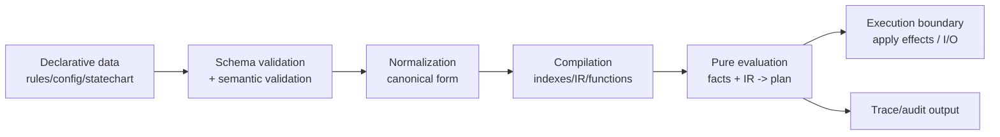

# Data Over Logic: Practical Rules for Data-Driven Design in TypeScript

Replace conditional logic (if/else, switches, loops) with data structures. Use configuration-driven and declarative approaches instead of imperative control flow. Represent **variation** (policies, workflows, UI structure, business rules, routing, pricing, permissions) as **declarative data**, and keep the **mechanism** (evaluation, orchestration, rendering, execution) in **stable, generic code**.

## Common Domain Types Used in Examples

The rule examples reuse this minimal "promotion/shipping policy" domain.

```ts
// Domain input ("facts")
export type CustomerTier = "guest" | "member" | "vip";

export interface CartContext {
  country: string;      // ISO-like, simplified
  tier: CustomerTier;
  subtotal: number;     // in cents
  itemCount: number;
}

// Declarative condition AST (bounded)
export type Cond =
  | { kind: "all"; conditions: Cond[] }
  | { kind: "any"; conditions: Cond[] }
  | { kind: "not"; condition: Cond }
  | { kind: "countryIn"; countries: readonly string[] }
  | { kind: "tierIn"; tiers: readonly CustomerTier[] }
  | { kind: "subtotalGte"; cents: number }
  | { kind: "itemCountGte"; count: number };

// Declarative actions (bounded)
export type Action =
  | { type: "freeShipping" }
  | { type: "percentOffSubtotal"; percent: number; capCents?: number }
  | { type: "message"; text: string };

// A rule ("policy") is just data
export interface Rule {
  id: string;
  priority: number; // higher wins
  when: Cond;
  then: readonly Action[];
}

// Effects represent a plan (still data)
export type Effect =
  | { effect: "applyFreeShipping"; ruleId: string }
  | { effect: "applyPercentOff"; ruleId: string; percent: number; capCents?: number }
  | { effect: "emitMessage"; ruleId: string; text: string };
```

## Rule Catalog Summary

| Rule ID | Rule (short) | Short description | Effort |
|---|---|---|---|
| DOL-01 | Separate policy from mechanism | Externalize variability as data; keep the engine generic and stable. | Med |
| DOL-02 | Treat the data model as an API | Define explicit schemas/contracts for the data you interpret. | Med |
| DOL-03 | Use tagged unions for DSL nodes | Design data with discriminators so TS can narrow and validators can be strict. | Low-Med |
| DOL-04 | Validate at boundaries, not "somewhere" | Validate/normalize immediately when loading data; TS types are not runtime guards. | Med |
| DOL-05 | Keep the interpreter pure-ish | Interpreter returns a plan; side-effects happen in a separate execution layer. | Med |
| DOL-06 | Constrain expressiveness; avoid eval | Do not embed arbitrary code strings/functions in data; stick to a bounded DSL. | High |
| DOL-07 | Provide a controlled extension registry | Add new behaviors via explicit registration points, not ad-hoc branching. | Med |
| DOL-08 | Version the data and support migrations | Data formats evolve; include versions and migrate deterministically. | Med-High |
| DOL-09 | Make decisions explainable | Produce traces/audit metadata so you can answer "why did it do that?" | Med |
| DOL-10 | Treat data changes like code changes | CI tests/lints for rule sets; review and promote changes safely. | Med |
| DOL-11 | Compile/canonicalize for performance | Parse/compile once; evaluate many; cache compiled forms. | Med |
| DOL-12 | Use the pattern selectively | Don't build a DSL for low-variance logic; keep imperative code when it's clearer. | Low |

---

## DOL-01: Separate Policy from Mechanism

**Rule.** Put business/product variability (policy) in data; keep the interpreter/execution engine (mechanism) stable and generic.

**Rationale.** Flexibility comes from letting policies vary without rewriting mechanisms. Declarative systems exemplify this: Terraform configs describe outcomes (policy), Terraform handles step ordering (mechanism). OPA similarly decouples policy decision-making from enforcement.

**Trade-offs.** Indirection tax (debugging jumps from data to engine); requires investment in schema/validation/tooling.

**Pitfalls.** Teams externalize everything (including mechanisms/algorithms), leading to a sprawling DSL; or they keep "just a few special cases" in code, drifting back into hard-coded rule spaghetti.

```ts
// BAD: Policy encoded directly as branching logic
export function shippingCostCents(ctx: CartContext): number {
  if (ctx.country === "BR") {
    if (ctx.tier === "vip") return 0;
    if (ctx.subtotal >= 20_000) return 0;
    return 2_500;
  }

  if (ctx.country === "US") {
    if (ctx.subtotal >= 50_000) return 0;
    return 1_500;
  }

  return 4_000;
}
```

```ts
// GOOD: Policy as data + a stable evaluator
type ShippingPolicy = {
  id: string;
  when: Cond;
  costCents: number;
};

const shippingPolicies: readonly ShippingPolicy[] = [
  {
    id: "BR_free_for_vip",
    when: { kind: "all", conditions: [{ kind: "countryIn", countries: ["BR"] }, { kind: "tierIn", tiers: ["vip"] }] },
    costCents: 0,
  },
  {
    id: "BR_free_over_200",
    when: { kind: "all", conditions: [{ kind: "countryIn", countries: ["BR"] }, { kind: "subtotalGte", cents: 20_000 }] },
    costCents: 0,
  },
  {
    id: "BR_default",
    when: { kind: "countryIn", countries: ["BR"] },
    costCents: 2_500,
  },
  {
    id: "US_free_over_500",
    when: { kind: "all", conditions: [{ kind: "countryIn", countries: ["US"] }, { kind: "subtotalGte", cents: 50_000 }] },
    costCents: 0,
  },
  { id: "fallback", when: { kind: "any", conditions: [] }, costCents: 4_000 },
];

function evalCond(cond: Cond, ctx: CartContext): boolean {
  switch (cond.kind) {
    case "all": return cond.conditions.every((c) => evalCond(c, ctx));
    case "any": return cond.conditions.length === 0 ? true : cond.conditions.some((c) => evalCond(c, ctx));
    case "not": return !evalCond(cond.condition, ctx);
    case "countryIn": return cond.countries.includes(ctx.country);
    case "tierIn": return cond.tiers.includes(ctx.tier);
    case "subtotalGte": return ctx.subtotal >= cond.cents;
    case "itemCountGte": return ctx.itemCount >= cond.count;
  }
}

export function shippingCostCents(ctx: CartContext): number {
  const match = shippingPolicies.find((p) => evalCond(p.when, ctx));
  if (!match) throw new Error("No shipping policy matched (missing fallback?)");
  return match.costCents;
}
```

---

## DOL-02: Treat the Data Model as an API with an Explicit Schema

**Rule.** Your declarative data format is a public API. Define its structure and constraints explicitly (schema + documentation), and keep the engine and schema in sync.

**Rationale.** Declarative systems publish explicit contracts for their input data. JSON Schema defines structure for validation/documentation. JTD (RFC 8927) intentionally limits expressiveness to enable portable validation and tooling.

**Trade-offs.** Schema design is real work. Overly rigid schemas slow iteration; overly loose schemas cause runtime surprises.

**Pitfalls.** Schema drift (engine accepts more/less than schema says), "schema by TypeScript interface only," neglecting semantic constraints (e.g., priority uniqueness, percent bounds).

```ts
// BAD: "Schema" is implied by ad-hoc usage; anything goes
const rules: any[] = JSON.parse(process.env.RULES_JSON ?? "[]");

for (const r of rules) {
  if (r.when.country === "BR" && r.then.discount > 10) {
    // guessing shape; runtime errors happen far away
  }
}
```

```ts
// GOOD: Explicit runtime schema, compile a validator once
import Ajv, { JTDSchemaType } from "ajv/dist/jtd";
import { type Rule } from "./types";

type JtdCond =
  | { kind: "countryIn"; countries: string[] }
  | { kind: "subtotalGte"; cents: number };

const condSchema: JTDSchemaType<JtdCond> = {
  discriminator: "kind",
  mapping: {
    countryIn: { properties: { countries: { elements: { type: "string" } } } },
    subtotalGte: { properties: { cents: { type: "uint32" } } },
  },
};

type JtdRule = Omit<Rule, "when"> & { when: JtdCond };

const ruleSchema: JTDSchemaType<JtdRule> = {
  properties: {
    id: { type: "string" },
    priority: { type: "int32" },
    when: condSchema,
    then: { elements: { properties: { type: { type: "string" } }, optionalProperties: { percent: { type: "uint8" } } } },
  },
};

const ajv = new Ajv();
const validateRule = ajv.compile(ruleSchema);

export function parseRulesOrThrow(json: unknown): JtdRule[] {
  if (!Array.isArray(json)) throw new Error("Rules must be an array");

  for (const [i, item] of json.entries()) {
    if (!validateRule(item)) {
      throw new Error(`Invalid rule at index ${i}`);
    }
  }

  return json as JtdRule[];
}
```

---

## DOL-03: Use Tagged/Discriminated Unions for DSL Nodes

**Rule.** Every "instruction" node in your declarative data should be a **tagged** (discriminated) union with a clear discriminator field (`kind`, `type`, etc.).

**Rationale.** Discriminated unions allow TypeScript control-flow narrowing and produce safer, more maintainable interpreters. JTD's discriminator form explicitly defines tagged unions.

**Trade-offs.** Slight verbosity. You must manage compatibility when adding new variants.

**Pitfalls.** Untagged unions ("if it has `countries` it must be X"), ambiguous shapes that overlap, "stringly typed operators" without enumerated discriminators.

```ts
// BAD: Untagged, ambiguous shapes
type BadCond =
  | { countries: string[] }
  | { cents: number }
  | { conditions: BadCond[]; mode?: "all" | "any" };

function evalBad(cond: BadCond, ctx: CartContext): boolean {
  if ("countries" in cond) return cond.countries.includes(ctx.country);
  if ("cents" in cond) return ctx.subtotal >= cond.cents;
  if ("conditions" in cond) return (cond.mode ?? "all") === "all"
    ? cond.conditions.every((c) => evalBad(c, ctx))
    : cond.conditions.some((c) => evalBad(c, ctx));
  return false;
}
```

```ts
// GOOD: Tagged unions with exhaustiveness check
function evalCond(cond: Cond, ctx: CartContext): boolean {
  switch (cond.kind) {
    case "all": return cond.conditions.every((c) => evalCond(c, ctx));
    case "any": return cond.conditions.some((c) => evalCond(c, ctx));
    case "not": return !evalCond(cond.condition, ctx);
    case "countryIn": return cond.countries.includes(ctx.country);
    case "tierIn": return cond.tiers.includes(ctx.tier);
    case "subtotalGte": return ctx.subtotal >= cond.cents;
    case "itemCountGte": return ctx.itemCount >= cond.count;
    default: {
      const _exhaustive: never = cond;
      return _exhaustive;
    }
  }
}
```

---

## DOL-04: Validate and Normalize at the Boundary

**Rule.** Treat declarative data as **untrusted input**: validate it *immediately when loaded*, normalize it into a canonical internal representation, and fail fast with actionable errors.

**Rationale.** TypeScript's type syntax is erasable, leaving valid JavaScript. TS types alone cannot guarantee runtime correctness. Validators like Ajv emphasize validating "as soon as it arrives" and compiling schemas for efficient repeated validation.

**Trade-offs.** Validation has CPU cost and can add startup latency; mitigate by compiling validators once (DOL-11) and validating at ingestion boundaries.

**Pitfalls.** Validating only in some call sites, letting invalid configs partially load, "best-effort" interpretation, failing without context (no path/rule id).

```ts
// BAD: Lazy validation, failing deep inside evaluation
export function loadRulesFromEnv(): Rule[] {
  const raw = JSON.parse(process.env.RULES_JSON ?? "[]");
  return raw as Rule[];
}

export function plan(ctx: CartContext, rules: Rule[]): Effect[] {
  const sorted = [...rules].sort((a, b) => b.priority - a.priority);
  // crashes if rule.then isn't an array, etc.
  return [];
}
```

```ts
// GOOD: Centralized boundary validation + normalization
type NormalizedRule = Rule & { priority: number };

function normalizeRule(r: Rule): NormalizedRule {
  return {
    ...r,
    priority: Number.isFinite(r.priority) ? r.priority : 0,
  };
}

export function loadRulesOrThrow(parseJson: unknown, validate: (x: unknown) => x is Rule[]): NormalizedRule[] {
  if (!validate(parseJson)) {
    throw new Error("Invalid rules payload (schema validation failed)");
  }

  const normalized = parseJson.map(normalizeRule);

  const ids = new Set<string>();
  for (const r of normalized) {
    if (ids.has(r.id)) throw new Error(`Duplicate rule id: ${r.id}`);
    ids.add(r.id);
  }

  return normalized;
}
```

---

## DOL-05: Keep the Interpreter Pure-ish; Separate Evaluation from Side Effects

**Rule.** Make your interpreter **deterministic**: it should transform input facts + declarative data into a **plan/effects** (data). Apply the effects in a separate, explicit execution step.

**Rationale.** Complexity is worsened by state/control entanglement. Mature interpreters keep a pure core: XState's `machine.transition(...)` is a pure function, and the interpreter executes actions separately.

**Trade-offs.** Two-step architecture (plan then execute) adds structure and sometimes boilerplate. Requires effect modeling discipline.

**Pitfalls.** Interpreter mutates global state, performs I/O, or mixes decision-making with execution in ways that prevent replay/debugging.

```ts
// BAD: Interpreter performs effects inline
async function applyRulesBad(ctx: CartContext, rules: Rule[]): Promise<void> {
  for (const r of rules) {
    if (evalCond(r.when, ctx)) {
      for (const a of r.then) {
        if (a.type === "message") {
          await fetch("https://logger.internal/messages", {
            method: "POST",
            body: JSON.stringify({ rule: r.id, text: a.text }),
          });
        }
      }
    }
  }
}
```

```ts
// GOOD: Interpreter returns effects; caller decides how to execute
export function planEffects(ctx: CartContext, rules: readonly Rule[]): Effect[] {
  const sorted = [...rules].sort((a, b) => b.priority - a.priority);
  const effects: Effect[] = [];

  for (const r of sorted) {
    if (!evalCond(r.when, ctx)) continue;

    for (const a of r.then) {
      switch (a.type) {
        case "freeShipping":
          effects.push({ effect: "applyFreeShipping", ruleId: r.id });
          break;
        case "percentOffSubtotal":
          effects.push({ effect: "applyPercentOff", ruleId: r.id, percent: a.percent, capCents: a.capCents });
          break;
        case "message":
          effects.push({ effect: "emitMessage", ruleId: r.id, text: a.text });
          break;
      }
    }
  }

  return effects;
}

export async function executeEffects(effects: readonly Effect[]): Promise<void> {
  for (const e of effects) {
    if (e.effect === "emitMessage") {
      console.log(`[rule=${e.ruleId}] ${e.text}`);
    }
  }
}
```

---

## DOL-06: Constrain Expressiveness; Never "eval" Your Configuration

**Rule.** Your declarative format must be **bounded**. Do **not** embed arbitrary code (strings executed via `eval`, dynamic `Function`, or serialized functions) inside configuration/rules.

**Rationale.** Declarative tools explicitly avoid being general-purpose languages. `eval()` executes code represented as a string and defeats important security protections. Bounded expressiveness makes validation and tooling feasible.

**Trade-offs.** You can't express everything. Some edge cases require extending the engine (DOL-07) or adding controlled, audited escape hatches.

**Pitfalls.** "Just for this one use-case we allow JS expressions," leading to injection risk, debugging hell, and untestable behavior.

```ts
// BAD: Code-in-data via eval
type BadRule = { id: string; whenJs: string; thenJs: string };

function runBadRule(rule: BadRule, ctx: CartContext) {
  if (eval(rule.whenJs)) {
    eval(rule.thenJs);
  }
}
```

```ts
// GOOD: Bounded AST + safe registry for actions
type SafeAction = { type: "addTag"; tag: string } | { type: "freeShipping" };

type SafeRule = { id: string; when: Cond; then: readonly SafeAction[] };

const actionHandlers: Record<SafeAction["type"], (ctx: CartContext, a: any) => Effect[]> = {
  addTag: (_ctx, a: { tag: string }) => [{ effect: "emitMessage", ruleId: "tagger", text: `tag=${a.tag}` }],
  freeShipping: (_ctx) => [{ effect: "applyFreeShipping", ruleId: "shipping" }],
};

function interpretSafe(rule: SafeRule, ctx: CartContext): Effect[] {
  if (!evalCond(rule.when, ctx)) return [];
  return rule.then.flatMap((a) => actionHandlers[a.type](ctx, a));
}
```

---

## DOL-07: Provide Controlled Extension Points (Registries), Not Ad-hoc Branching

**Rule.** If the system must grow, it should grow via **explicit extension registries** (new `Cond.kind`, new `Action.type`, plugin interface), not scattered `if (rule.id === ...)` exceptions.

**Rationale.** Declarative systems pair a stable core model with extension points: Terraform has providers, OPA has a stable query interface and built-ins, state machine libraries separate machine definitions from interpreters.

**Trade-offs.** A registry is an API surface you must govern (versioning, compatibility). You need good error messages when an unknown extension is referenced.

**Pitfalls.** Uncontrolled plugin loading (security), silent fallbacks for unknown types, version skew between rule data and engine capabilities.

```ts
// BAD: Hidden special cases
function planWithExceptions(ctx: CartContext, rules: Rule[]): Effect[] {
  const out: Effect[] = [];

  for (const r of rules) {
    if (r.id === "vip_secret_override") {
      out.push({ effect: "applyPercentOff", ruleId: r.id, percent: 99 });
      continue;
    }

    if (evalCond(r.when, ctx)) {
      // ...
    }
  }

  return out;
}
```

```ts
// GOOD: Explicit registry + explicit modeling
export type ExtCond =
  | Cond
  | { kind: "isWeekend"; timezone: string };

type CondEvaluator<C extends { kind: string }> = (cond: C, ctx: CartContext) => boolean;

const condEvaluators: Record<string, CondEvaluator<any>> = {
  all: (c: Extract<Cond, { kind: "all" }>, ctx) => c.conditions.every((x) => evalAny(x, ctx)),
  // ... base evaluators ...
  isWeekend: (c: Extract<ExtCond, { kind: "isWeekend" }>, _ctx) => {
    return ["Sat", "Sun"].includes(new Date().toUTCString().slice(0, 3));
  },
};

function evalAny(cond: ExtCond, ctx: CartContext): boolean {
  const f = condEvaluators[cond.kind];
  if (!f) throw new Error(`Unknown condition kind: ${cond.kind}`);
  return f(cond as any, ctx);
}
```

---

## DOL-08: Version Declarative Data and Provide Deterministic Migrations

**Rule.** Every non-trivial declarative format must be **versioned**, and you must support migration (or multi-version readers) explicitly.

**Rationale.** Declarative ecosystems formalize versioning because data outlives code. JSON Schema is versioned by drafts, Kubernetes configuration is versioned via API versions.

**Trade-offs.** Versioning adds governance overhead and requires a deprecation strategy.

**Pitfalls.** "Versionless JSON" that changes shape silently; breaking changes shipped as "just another rule update"; non-idempotent migrations.

```ts
// BAD: Implicit format changes
// Yesterday: { type: "percentOffSubtotal", percent: 10 }
// Today:    { type: "percentOffSubtotal", pct: 10 }
// No versioning; old data breaks silently.

export function readAction(a: any): Action {
  return a as Action;
}
```

```ts
// GOOD: Explicit version + migration
type RuleSetV1 = { schemaVersion: 1; rules: Rule[] };
type RuleSetV2 = { schemaVersion: 2; rules: (Omit<Rule, "priority"> & { priority: number })[]; defaults: { priority: number } };

type AnyRuleSet = RuleSetV1 | RuleSetV2;

function migrateToV2(v1: RuleSetV1): RuleSetV2 {
  return {
    schemaVersion: 2,
    defaults: { priority: 0 },
    rules: v1.rules.map((r) => ({ ...r, priority: Number.isFinite(r.priority) ? r.priority : 0 })),
  };
}

export function loadRuleSet(any: AnyRuleSet): RuleSetV2 {
  switch (any.schemaVersion) {
    case 1: return migrateToV2(any);
    case 2: return any;
    default: {
      const _never: never = any;
      throw new Error(`Unsupported schemaVersion: ${(any as any).schemaVersion}`);
    }
  }
}
```

---

## DOL-09: Make Decisions Explainable (Traces, Rule IDs, Audit Metadata)

**Rule.** Every evaluation should be traceable: which rule matched, which conditions passed/failed, and which effects were produced.

**Rationale.** Policy systems advertise auditability as a core feature. If you can't explain outcomes, data-driven systems become ungovernable -- especially when non-authors edit the data.

**Trade-offs.** Tracing can add overhead and log volume; you need sampling, structured logs, and careful PII handling.

**Pitfalls.** Boolean-only results, missing rule IDs, "best match wins" logic without reporting why.

```ts
// BAD: No explanation
export function eligibleForFreeShipping(ctx: CartContext, rules: Rule[]): boolean {
  return rules.some((r) => evalCond(r.when, ctx) && r.then.some((a) => a.type === "freeShipping"));
}
```

```ts
// GOOD: Return a decision record
export type DecisionTrace = {
  matchedRuleIds: string[];
  effects: Effect[];
};

export function planWithTrace(ctx: CartContext, rules: readonly Rule[]): DecisionTrace {
  const sorted = [...rules].sort((a, b) => b.priority - a.priority);
  const matchedRuleIds: string[] = [];
  const effects: Effect[] = [];

  for (const r of sorted) {
    const matched = evalCond(r.when, ctx);
    if (!matched) continue;

    matchedRuleIds.push(r.id);
    effects.push(...planEffects(ctx, [r]));
  }

  return { matchedRuleIds, effects };
}
```

---

## DOL-10: Treat Data Changes Like Code Changes (CI, Tests, Review Gates)

**Rule.** Rule/config changes must go through **the same discipline as code**: version control, review, validation, automated tests, and controlled promotion.

**Rationale.** Mature declarative ecosystems treat configuration with software rigor. OPA explicitly supports writing tests for policies to reduce time-to-change and risk.

**Trade-offs.** Requires maintaining test fixtures and building tooling (linters, preview environments).

**Pitfalls.** Editing config directly in prod consoles, unreviewed hotfixes, no regression suite for rule sets.

```ts
// BAD: Rules exist only as runtime JSON; no tests
// RULES_JSON updated manually in prod; nobody can reproduce behavior locally.
const rules = JSON.parse(process.env.RULES_JSON ?? "[]") as Rule[];
console.log(planEffects({ country: "BR", tier: "vip", subtotal: 1000, itemCount: 1 }, rules));
```

```ts
// GOOD: Store canonical rules in-repo and test them
// rules.ts
import { type Rule } from "./types";

export const RULES = [
  {
    id: "free_shipping_vip",
    priority: 100,
    when: { kind: "tierIn", tiers: ["vip"] },
    then: [{ type: "freeShipping" }],
  },
] as const satisfies readonly Rule[];

// rules.test.ts
import { RULES } from "./rules";
import { planEffects } from "./engine";

const ctx = { country: "BR", tier: "vip", subtotal: 10_00, itemCount: 1 };

const effects = planEffects(ctx, RULES);
if (!effects.some((e) => e.effect === "applyFreeShipping")) {
  throw new Error("Expected VIP to get free shipping");
}
```

---

## DOL-11: Compile/Canonicalize for Performance and Correctness

**Rule.** Do expensive work once: parse, validate, normalize, compile into a fast internal representation. Evaluate using compiled artifacts.

**Rationale.** Ajv's model is optimized for "schema compilation happens only once and validation happens multiple times." Terraform separates authoring config from executing a plan by analyzing desired state and computing dependencies.

**Trade-offs.** Adds a compilation step and internal IR structure. Must handle hot-reload safely if rules change at runtime.

**Pitfalls.** Re-parsing JSON and recompiling validators per request, non-cached derived structures, complicated merge logic at runtime.

```ts
// BAD: Recompile/parse repeatedly
import Ajv from "ajv";

export function handler(rawRulesJson: string, ctx: CartContext) {
  const ajv = new Ajv();                  // created per request
  const rules = JSON.parse(rawRulesJson); // parsed per request
  return planEffects(ctx, rules as Rule[]);
}
```

```ts
// GOOD: Compile once, reuse
import Ajv from "ajv";

type Compiled = {
  rules: readonly Rule[];
};

export function compileRuleRuntime(raw: unknown, validateRules: (x: unknown) => x is Rule[]): Compiled {
  const rules = loadRulesOrThrow(raw, validateRules);
  return { rules };
}

export function evaluate(compiled: Compiled, ctx: CartContext): Effect[] {
  return planEffects(ctx, compiled.rules);
}
```

---

## DOL-12: Apply the Pattern Selectively; Don't Build a DSL for Low-Variance Code

**Rule.** Only push logic into data when there is real, recurring variability or multi-tenant/product configurability. Otherwise, keep the logic imperative and explicit.

**Rationale.** Many declarative systems clearly scope themselves: Bicep explicitly says it is not meant as a general programming language. Declarative design is a trade -- great for configuration/policy/desired state, but not always ideal for bespoke algorithms or one-off logic.

**Trade-offs.** You may miss out on some flexibility, but you gain clarity and reduce interpreter/platform burden.

**Pitfalls.** Over-engineering: building a "rule engine" for a single `if` branch; forcing complex algorithms into data, recreating a programming language poorly.

```ts
// BAD: DSL where a simple function would be clearer
const bannerRules: Rule[] = [
  { id: "show_banner", priority: 1, when: { kind: "countryIn", countries: ["BR"] }, then: [{ type: "message", text: "Show banner" }] },
];
```

```ts
// GOOD: Straightforward code for low variability
export function shouldShowBanner(country: string): boolean {
  return country === "BR";
}
```

---

## Quick Refactoring Patterns

These micro-level tactics complement the DOL rules above for everyday code-level refactoring.

### Replace Multiple Comparisons with Array.includes()

```tsx
// BAD
if (USER_ROLE.USER === role && USER_ROLE.ADMIN === role) {
  // ...
}

// GOOD
const VALID_ROLES_FOR_X_CASE = [USER_ROLE.USER, USER_ROLE.ADMIN];
if (VALID_ROLES_FOR_X_CASE.includes(role)) {
  // ...
}
```

### Replace Chained If Statements with reduce()

```tsx
// BAD
const preparePayload = {}
if (USER_ROLE.USER === role) { /* add payload */ }
if (isUserInAllowList(role)) { /* expand payload */ }
if (someOtherConsideration(role)) { /* expand more */ }

// GOOD
type Payload = {
  basicValues: Record<string, unknown>;
  expanded?: Record<string, unknown>;
};

type Actions = [
  test: (role: USER_ROLE) => boolean,
  action: (role: USER_ROLE, payload: Payload) => Payload
][];

const actionConfiguration: Actions = [
  [(role) => USER_ROLE.USER === role, (role, payload) => { /* modify */ }],
  [(role) => isUserInAllowList(role), (role, payload) => { /* modify */ }],
  [(role) => someOtherConsideration(role), (role, payload) => { /* modify */ }],
];

const preparePayload = actionConfiguration.reduce((payload, [test, action]) => {
  return test(role) ? action(role, payload) : payload;
}, {});
```

### Replace Complex Conditionals with find()

```tsx
// GOOD: Use find() for first-match scenarios
const [, action] = actionConfiguration.find(([test]) => test(role));
return action(role, {});
```

### Use Record Types for Action Mapping

```tsx
type ActionByRoleMap = Record<USER_ROLE, (role: USER_ROLE) => void>;

const actionByRoleMap: ActionByRoleMap = {
  [USER_ROLE.ADMIN]: (role) => { /* admin action */ },
  [USER_ROLE.USER]: (role) => { /* user action */ },
  [USER_ROLE.GUEST]: (role) => { /* guest action */ },
} as const;

function performActionByRole(role: string = USER_ROLE.GUEST) {
  const definedRole = isValidRole(role) ? role : USER_ROLE.GUEST;
  return actionByRoleMap[definedRole](definedRole);
}
```

---

## Reference Architecture

A robust "data over logic" system usually looks like this pipeline:



Key architecture principles:
- **Validate/understand structure** (JSON Schema describes structure/constraints; JTD aims for portable validation/tooling)
- **Compute a plan** (Terraform plans compare desired vs actual; Kubernetes controllers reconcile desired vs current)
- **Keep a "logic core" pure-ish** (XState emphasizes pure transitions with an interpreter executing actions)
- **Single-source-of-truth control** for declarative artifacts (don't mutate policy in two places)
