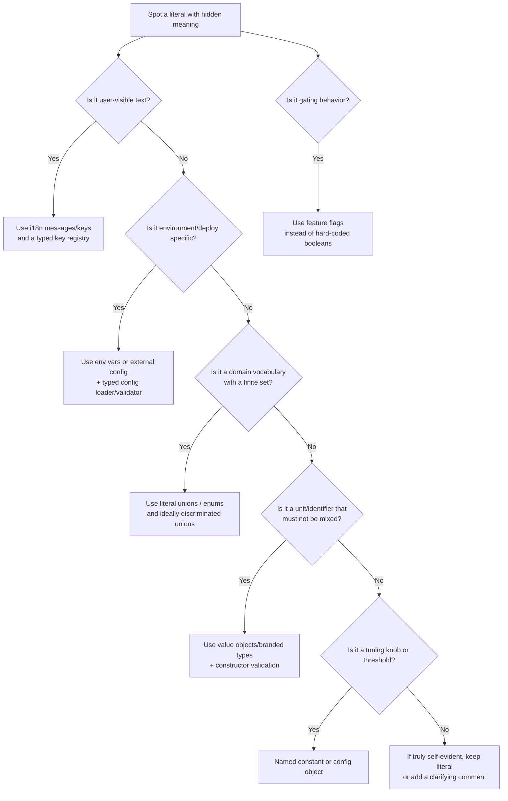

# Avoid Magic Values — Use Strongly Typed Constants, Registries, and Types

Magic values (unexplained literals like `"PENDING"`, `42`, `true`, `3_600_000`) increase cognitive load, encourage duplication, and make refactors brittle because meaning lives in people's heads instead of code. The highest-return strategy is to **systematically turn "meaning" into names and types**, using TypeScript's literal types, `as const`, discriminated unions, and `satisfies`.

Not every literal is bad. "Self-evident" values (e.g., `0` used as an initial accumulator) are often fine; the key is whether the literal is a **policy, domain vocabulary, integration detail, or tuning knob**.

## Rule Summary Table

| Pattern / rule | Complexity | Safety | Runtime cost | Refactor effort |
|---|---|---|---|---|
| Named constants for policy literals | Low | Medium | None | Low |
| Constant registry object + `as const` | Low-Medium | Medium-High | None | Low-Medium |
| Literal unions for finite sets | Medium | High (prevents typos) | None | Medium |
| Lookup tables + `satisfies` completeness | Medium | High (missing/extra keys caught) | None | Medium |
| Discriminated unions + exhaustive checks | Medium-High | Very High | None | High |
| `enum` (runtime sets) | Medium | High | Medium (runtime object) | Medium |
| Central typed `AppConfig` module | Medium | Medium-High | Low | Medium |
| Env vars + typed parsing at startup | Medium | High (runtime validated) | Low-Medium | Medium |
| Unit helpers (`minutes()`, `bytes()`) | Low-Medium | Medium | None | Low-Medium |
| Value objects / branded types | High | Very High (unit/invariant safety) | Low-Medium | High |
| Template literal types for structured strings | Medium-High | High | None | Medium-High |
| Typed i18n key/message registry | Medium | High (prevents key typos) | None | Medium |
| Dependency injection | High | Medium-High (testability) | Low | High |
| Feature flags | High | Medium-High (operational control) | Medium | Medium-High |
| Lint + tests enforcing non-magic values | Medium | Medium-High (guardrails) | None-Low | Medium |

## Refactor Decision Flowchart



---

## Foundation Tier: Low Complexity, High ROI

### Extract Named Constants for Policy Literals

**Rule.** Any literal encoding policy (limits, thresholds, default timeouts, base probabilities) or repeated more than once should be a named constant.

**Rationale.** Named constants make meaning explicit and align with widely adopted lint guidance that special numbers should be declared as constants.

```ts
// BAD
export function isPasswordTooShort(password: string): boolean {
  return password.length < 12;
}
```

```ts
// GOOD
const MIN_PASSWORD_LENGTH = 12;

export function isPasswordTooShort(password: string): boolean {
  return password.length < MIN_PASSWORD_LENGTH;
}
```

---

### Group Related Constants into a Registry with `as const`

**Rule.** Families of related string/number tokens (HTTP headers, event names, error codes, CSS class names) should be grouped into a registry object. `as const` prevents widening and makes object properties readonly.

```ts
// BAD
export function getRequestId(headers: Record<string, string | undefined>): string | undefined {
  return headers["x-request-id"];
}
```

```ts
// GOOD
export const HTTP_HEADERS = {
  requestId: "x-request-id",
  contentType: "content-type",
} as const;

export type HttpHeaderName = typeof HTTP_HEADERS[keyof typeof HTTP_HEADERS];

export function getHeader(
  headers: Record<string, string | undefined>,
  name: HttpHeaderName,
): string | undefined {
  return headers[name];
}

export function getRequestId(headers: Record<string, string | undefined>): string | undefined {
  return getHeader(headers, HTTP_HEADERS.requestId);
}
```

---

### Replace "Stringly Typed" Parameters with Literal Unions

**Rule.** Inputs representing a finite set (status, role, plan type, currency code subset) should use literal unions derived from registries, not bare `string`.

**Rationale.** Unions of string literal types help avoid misspellings and let the compiler detect invalid comparisons/values.

```ts
// BAD
export function setOrderStatus(orderId: string, status: string): void {
  // status might be "shiped" and compile fine
  void orderId;
  void status;
}
```

```ts
// GOOD
const ORDER_STATUSES = ["pending", "paid", "shipped"] as const;
export type OrderStatus = typeof ORDER_STATUSES[number];

export function setOrderStatus(orderId: string, status: OrderStatus): void {
  void orderId;
  void status;
}
```

---

### Prefer Lookup Tables Over Repeated Conditionals with Magic Literals

**Rule.** "If X then Y" rules where X is from a finite set should use a lookup table. Pair with `satisfies` for complete coverage checks.

```ts
// BAD
export function statusColor(status: "pending" | "paid" | "shipped"): string {
  if (status === "pending") return "yellow";
  if (status === "paid") return "green";
  return "blue";
}
```

```ts
// GOOD
type OrderStatus = "pending" | "paid" | "shipped";

const STATUS_COLOR = {
  pending: "yellow",
  paid: "green",
  shipped: "blue",
} as const satisfies Record<OrderStatus, string>;

export function statusColor(status: OrderStatus): string {
  return STATUS_COLOR[status];
}
```

---

## Type-Safety Tier: Encode Meaning into Types

### Discriminated Unions + Exhaustiveness

**Rule.** Replace "bag of `any`" variant objects with discriminated unions using a shared literal property (e.g., `kind`, `type`) and enforce exhaustiveness with `never`.

```ts
// BAD
export type Payment = {
  type: string;
  cardLast4?: string;
  pixKey?: string;
};

export function describePayment(p: Payment): string {
  if (p.type === "card") return `Card ****${p.cardLast4 ?? "????"}`;
  if (p.type === "pix") return `PIX ${p.pixKey ?? "missing"}`;
  return "Unknown";
}
```

```ts
// GOOD
export type Payment =
  | { type: "card"; cardLast4: string }
  | { type: "pix"; pixKey: string };

function assertNever(x: never): never {
  throw new Error(`Unexpected variant: ${JSON.stringify(x)}`);
}

export function describePayment(p: Payment): string {
  switch (p.type) {
    case "card":
      return `Card ****${p.cardLast4}`;
    case "pix":
      return `PIX ${p.pixKey}`;
    default:
      return assertNever(p);
  }
}
```

---

### Enums for Runtime Sets (Prefer String Enums)

**Rule.** Use enums when values must exist at runtime for iteration, reverse mapping, or consumption by non-TypeScript code. Prefer string enums for readable runtime values (numeric enums can be opaque). Avoid `const enum` (toolchain pitfalls with single-file transpilers).

```ts
// BAD
export function isRetryableStatus(httpStatus: number): boolean {
  return httpStatus === 408 || httpStatus === 429 || httpStatus === 503;
}
```

```ts
// GOOD
export enum HttpStatus {
  RequestTimeout = 408,
  TooManyRequests = 429,
  ServiceUnavailable = 503,
}

export function isRetryableStatus(httpStatus: number): boolean {
  return (
    httpStatus === HttpStatus.RequestTimeout ||
    httpStatus === HttpStatus.TooManyRequests ||
    httpStatus === HttpStatus.ServiceUnavailable
  );
}
```

---

### Use `satisfies` for Typed Config Objects

**Rule.** Use `satisfies` to ensure "complete and only" keys in central maps/config while preserving precise literals. Catches misspelled keys and missing entries at compile time.

```ts
// BAD
type Country = "US" | "BR" | "DE";

const TAX_RATE_BY_COUNTRY = {
  US: 0.07,
  BR: 0.12,
  // DE forgotten; nothing forces completeness
};

export function totalWithTax(country: Country, subtotal: number): number {
  const rate = (TAX_RATE_BY_COUNTRY as Record<string, number>)[country] ?? 0;
  return subtotal * (1 + rate);
}
```

```ts
// GOOD
type Country = "US" | "BR" | "DE";

const TAX_RATE_BY_COUNTRY = {
  US: 0.07,
  BR: 0.12,
  DE: 0.19,
} as const satisfies Record<Country, number>;

export function totalWithTax(country: Country, subtotal: number): number {
  return subtotal * (1 + TAX_RATE_BY_COUNTRY[country]);
}
```

---

## Configuration Tier: Separate Deploy-Time Values from Code

### Centralize Configuration into a Typed `AppConfig` Module

**Rule.** Values used in multiple modules or across layers (timeouts, retry policy, API endpoints, feature toggles) should live in a central typed config module, not scattered as literals.

```ts
// BAD
export async function fetchWithTimeout(url: string): Promise<string> {
  const timeoutMs = 5_000; // What is this based on? Who owns it?
  void timeoutMs;
  return `GET ${url}`;
}
```

```ts
// GOOD
export type AppConfig = Readonly<{
  httpTimeoutMs: number;
}>;

export const CONFIG: AppConfig = {
  httpTimeoutMs: 5_000,
};

export async function fetchWithTimeout(url: string): Promise<string> {
  const timeoutMs = CONFIG.httpTimeoutMs;
  void timeoutMs;
  return `GET ${url}`;
}
```

---

### Externalize Environment-Specific Values to Env Vars

**Rule.** Base URLs, credentials, region settings, environment mode, and tunables that differ between dev/stage/prod should be parsed from environment variables into types at startup. Follows the Twelve-Factor App methodology.

```ts
// BAD
export const PAYMENTS_BASE_URL = "https://payments.prod.example.com";
```

```ts
// GOOD
export type RawEnv = Readonly<Record<string, string | undefined>>;

function requireEnv(env: RawEnv, key: string): string {
  const value = env[key];
  if (!value) throw new Error(`Missing required env var: ${key}`);
  return value;
}

function parseBoolean(value: string): boolean {
  if (value === "true") return true;
  if (value === "false") return false;
  throw new Error(`Invalid boolean: ${value}`);
}

export type AppConfig = Readonly<{
  paymentsBaseUrl: string;
  enableNewCheckout: boolean;
}>;

export function loadConfig(env: RawEnv): AppConfig {
  return {
    paymentsBaseUrl: requireEnv(env, "PAYMENTS_BASE_URL"),
    enableNewCheckout: parseBoolean(requireEnv(env, "ENABLE_NEW_CHECKOUT")),
  };
}
```

---

## Semantics Tier: Make Units and Invariants Unrepresentable

### Semantic Helper Functions for Units

**Rule.** Repeated arithmetic like `60 * 60 * 1000` should use semantic helper functions to make intent explicit.

```ts
// BAD
export function cacheTtlMs(): number {
  return 60 * 60 * 1000; // 1 hour, but only if you already know
}
```

```ts
// GOOD
function seconds(n: number): number {
  return n * 1_000;
}

function minutes(n: number): number {
  return seconds(n * 60);
}

function hours(n: number): number {
  return minutes(n * 60);
}

export function cacheTtlMs(): number {
  return hours(1);
}
```

---

### Branded Types / Value Objects for Domain Concepts

**Rule.** When mixing values would be costly (currency, milliseconds vs seconds) or you need invariants (non-empty IDs, positive money), use branded types with constructor validation.

```ts
// BAD
export function scheduleRetry(delay: number): string {
  // Is delay seconds? milliseconds? negative allowed?
  return `Retry in ${delay}`;
}
```

```ts
// GOOD
declare const msBrand: unique symbol;
export type Milliseconds = number & { readonly [msBrand]: "Milliseconds" };

export function ms(value: number): Milliseconds {
  if (!Number.isFinite(value) || value < 0) {
    throw new Error(`Invalid Milliseconds: ${value}`);
  }

  return value as Milliseconds;
}

export function scheduleRetry(delay: Milliseconds): string {
  return `Retry in ${delay}ms`;
}

const delay = ms(2_000);
void scheduleRetry(delay);
```

---

### Template Literal Types for Structured Strings

**Rule.** Strings with a structure (resource paths, "prefix:suffix" keys, message IDs, versioned routes) should use template literal types to make them compile-time checked.

```ts
// BAD
export function userEndpoint(userId: string): string {
  return "/api/v1/usres/" + userId; // typo: "usres"
}
```

```ts
// GOOD
type ApiVersion = "v1";
type Resource = "users" | "orders";
export type ApiPath = `/api/${ApiVersion}/${Resource}/${string}`;

export function apiPath(version: ApiVersion, resource: Resource, id: string): ApiPath {
  return `/api/${version}/${resource}/${id}`;
}

export function userEndpoint(userId: string): ApiPath {
  return apiPath("v1", "users", userId);
}
```

---

## UI and Integration Tier

### Typed i18n Key Registry

**Rule.** User-facing text and translation keys used in multiple places should use a typed key registry instead of bare strings.

```ts
// BAD
type TFunction = (key: string) => string;

export function loginTitle(t: TFunction): string {
  return t("auth.login.title");
}
```

```ts
// GOOD
export const I18N_KEYS = {
  auth: {
    login: {
      title: "auth.login.title",
      submit: "auth.login.submit",
    },
  },
} as const;

export type I18nKey =
  | typeof I18N_KEYS.auth.login.title
  | typeof I18N_KEYS.auth.login.submit;

type TFunction = (key: I18nKey) => string;

export function loginTitle(t: TFunction): string {
  return t(I18N_KEYS.auth.login.title);
}
```

---

### Typed Protocol Wrappers (HTTP Methods, Headers, Error Codes)

**Rule.** Values that must match an external spec exactly (HTTP methods, OAuth grant types, webhook event names) should be centrally defined with literal unions or enums.

```ts
// BAD
export type HttpRequest = { method: string; url: string };

export function makeRequest(url: string): HttpRequest {
  return { method: "POSTT", url }; // typo slips through
}
```

```ts
// GOOD
const HTTP_METHODS = ["GET", "POST", "PUT", "DELETE"] as const;
type HttpMethod = typeof HTTP_METHODS[number];

export type HttpRequest = { method: HttpMethod; url: string };

export function makeRequest(url: string): HttpRequest {
  return { method: "POST", url };
}
```

---

## Architecture Tier

### Dependency Injection to Remove Hard-Coded Values

**Rule.** Code that hard-codes endpoints, credentials, filesystem paths, "real" clients, or clock/randomness should inject those dependencies instead.

```ts
// BAD
export class PaymentService {
  async charge(amountCents: number): Promise<string> {
    const baseUrl = "https://payments.example.com";
    void amountCents;
    return `POST ${baseUrl}/charge`;
  }
}
```

```ts
// GOOD
export interface HttpClient {
  postJson(url: string, body: unknown): Promise<unknown>;
}

export type PaymentServiceDeps = Readonly<{
  http: HttpClient;
  paymentsBaseUrl: string;
}>;

export class PaymentService {
  public constructor(private readonly deps: PaymentServiceDeps) {}

  async charge(amountCents: number): Promise<void> {
    await this.deps.http.postJson(`${this.deps.paymentsBaseUrl}/charge`, { amountCents });
  }
}
```

---

### Feature Flags Instead of Hard-Coded Booleans

**Rule.** Gradual rollouts, A/B tests, kill switches, and risky features should use feature flags, not hard-coded booleans or "temporary switches."

```ts
// BAD
export function checkoutFlow(userId: string): "legacy" | "new" {
  const useNewCheckout = true; // a "temporary" switch that will live for years
  void userId;
  return useNewCheckout ? "new" : "legacy";
}
```

```ts
// GOOD
export const FEATURE_FLAGS = {
  newCheckout: "newCheckout",
  fastRefunds: "fastRefunds",
} as const;

export type FeatureFlag = typeof FEATURE_FLAGS[keyof typeof FEATURE_FLAGS];

export interface FeatureFlagProvider {
  isEnabled(flag: FeatureFlag, context: { userId: string }): boolean;
}

export function checkoutFlow(
  flags: FeatureFlagProvider,
  userId: string,
): "legacy" | "new" {
  return flags.isEnabled(FEATURE_FLAGS.newCheckout, { userId }) ? "new" : "legacy";
}
```

---

## Lint Enforcement

**Rule.** Enable `@typescript-eslint/no-magic-numbers` (extends core ESLint rule with TypeScript-specific support for enum members, numeric literal types, readonly class properties). Add tests for mappings/registries so additions are deliberate.

```ts
// BAD
export function backoff(attempt: number): number {
  return 200 * attempt; // magic multiplier
}
```

```ts
// GOOD
const BACKOFF_STEP_MS = 200;

export function backoff(attempt: number): number {
  return BACKOFF_STEP_MS * attempt;
}
```

Example ESLint config:

```js
// .eslintrc.cjs (illustrative)
module.exports = {
  rules: {
    "no-magic-numbers": "off",
    "@typescript-eslint/no-magic-numbers": ["warn", { ignore: [0, 1, -1] }],
  },
};
```
